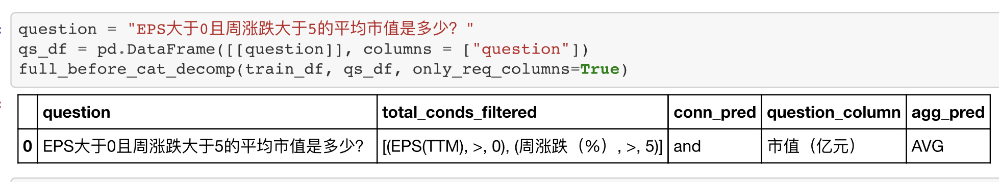
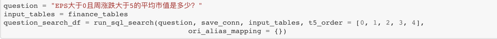
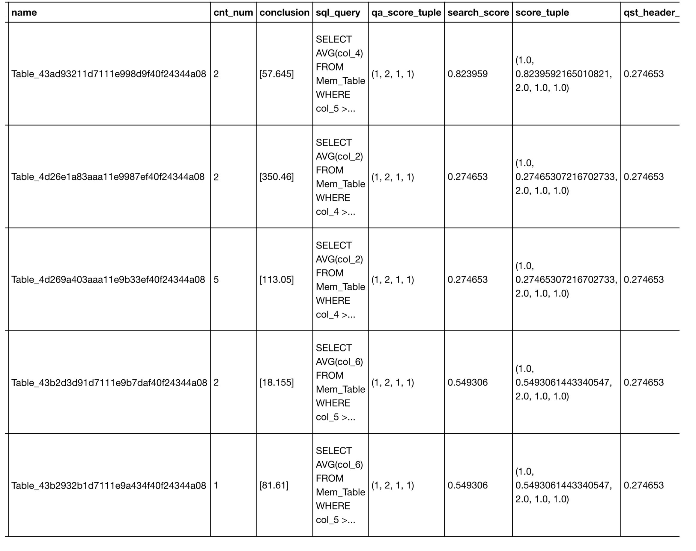
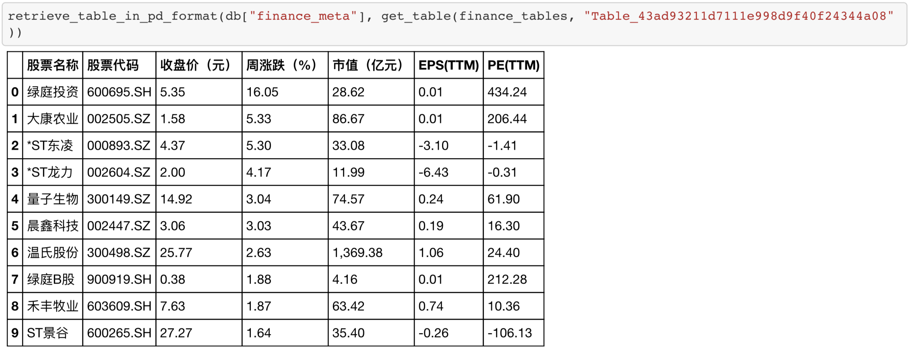

<!-- PROJECT LOGO -->
<br />
<p align="center">
  <h3 align="center">tableQA-Chinese</h3>

  <p align="center">
   		Unsupervised tableQA  and databaseQA on chinese financial question and tabular data
    <br />
  </p>
</p>


<!-- TABLE OF CONTENTS -->


<!-- ABOUT THE PROJECT -->
## About The Project

<!--
[![Product Name Screen Shot][product-screenshot]](https://example.com)
-->


<!--
There are many great README templates available on GitHub, however, I didn't find one that really suit my needs so I created this enhanced one. I want to create a README template so amazing that it'll be the last one you ever need.
-->

Querying natural language on tabular data is a common task for practical application, typically, for data with mixture of numerical and categories.
This project is a unsupervised tableQA attempts on chinese tabular data and databaseQA mainly on finance data.

<!--
Here's why:
* Your time should be focused on creating something amazing. A project that solves a problem and helps others
* You shouldn't be doing the same tasks over and over like creating a README from scratch
* You should element DRY principles to the rest of your life :smile:

Of course, no one template will serve all projects since your needs may be different. So I'll be adding more in the near future. You may also suggest changes by forking this repo and creating a pull request or opening an issue.

A list of commonly used resources that I find helpful are listed in the acknowledgements.
-->
### Built With
<!--
This section should list any major frameworks that you built your project using. Leave any add-ons/plugins for the acknowledgements section. Here are a few examples.
* [Bootstrap](https://getbootstrap.com)
* [JQuery](https://jquery.com)
* [Laravel](https://laravel.com)

* [Prophet](https://www.prophet.com/)
* [Scikit-Hts](https://github.com/carlomazzaferro/scikit-hts)
* [Hyperopt](https://github.com/hyperopt/hyperopt)

* [Gensim](https://github.com/RaRe-Technologies/gensim)
* [Wikipedia2Vec](https://github.com/wikipedia2vec/wikipedia2vec)
-->
* [JointBERT](https://github.com/monologg/JointBERT)
* [Snorkel](https://github.com/snorkel-team/snorkel)
* [Bertopic](https://github.com/MaartenGr/BERTopic)
* [sqlite-utils](https://github.com/simonw/sqlite-utils)


<!-- GETTING STARTED -->
## Getting Started
<!--
This is an example of how you may give instructions on setting up your project locally.
To get a local copy up and running follow these simple example steps.
-->

<!--
### Prerequisites

This is an example of how to list things you need to use the software and how to install them.
* npm
```sh
npm install npm@latest -g
```
-->

### Installation
[Snorkel](https://github.com/snorkel-team/snorkel) and [Bertopic](https://github.com/MaartenGr/BERTopic) may have some dependency conflict.
Recommend use three different visual environments provide by [conda](https://docs.conda.io/en/latest/) to distinguish [JointBERT](https://github.com/monologg/JointBERT) [Snorkel](https://github.com/snorkel-team/snorkel) [Bertopic](https://github.com/MaartenGr/BERTopic) respectively.

* conda
```sh
conda create -n jointbert_env python=3.8
conda activate jointbert_env
pip install -r jointbert_requirements.txt

conda create -n snorkel_env python=3.8
conda activate snorkel_env
bash snorkel_install.sh

conda create -n topic_env python=3.8
conda activate topic_env
bash topic_install.sh
```
Before use notebooks and scripts, type conda activate statement to init specific env.
Following is the different file and their env mapping.<br/>
<br/>
(jointbert_env)<br/>
[condition_trainer.py](https://github.com/svjack/tableQA-Chinese/blob/main/script/condition_trainer.py)<br/>
[tableQA_single_table.py](https://github.com/svjack/tableQA-Chinese/blob/main/script/tableQA_single_table.py)<br/>
[tableqa-single-valid.ipynb](https://github.com/svjack/tableQA-Chinese/blob/main/notebook/tableqa-single-valid.ipynb)<br/>
[fine-tune-on-finance.ipynb](https://github.com/svjack/tableQA-Chinese/blob/main/notebook/fine-tune-on-finance.ipynb)<br/>
<br/>
(snorkel_env)<br/>
[finance_dictionary_construction.py](https://github.com/svjack/tableQA-Chinese/blob/main/script/finance_dictionary_construct.py)<br/>
[agg-classifier.ipynb](https://github.com/svjack/tableQA-Chinese/blob/main/notebook/agg-classifier.ipynb)<br/>
[tableqa_finance_unsupervised.py](https://github.com/svjack/tableQA-Chinese/blob/main/script/tableqa_finance_unsupervised.py)<br/>
<br/>
(topic_env)<br/>
[tableqa_search.py](https://github.com/svjack/tableQA-Chinese/blob/main/script/tableqa_search.py)<br/>
<br/>
<br/>

<!-- USAGE EXAMPLES -->

<h1><b>Full Usage</b></h1>
&ensp; &ensp; &ensp; &ensp; &ensp; &ensp;With all train process.

## tableQA Usage
<!--
Use this space to show useful examples of how a project can be used. Additional screenshots, code examples and demos work well in this space. You may also link to more resources.

_For more examples, please refer to the [Documentation](https://example.com)_
-->

<h4>
<p>
<a href="https://github.com/ZhuiyiTechnology/TableQA">
1. Download chinese tableqa Data from github</a>
</p>
</h4>

<h4>
<p>
<a href="https://github.com/monologg/JointBERT">
2. Download JointBERT project</a>
</p>
</h4>

<h4>
<p>
<a href="https://github.com/svjack/tableQA-Chinese/blob/main/script/condition_trainer.py">3. Train condition extractor with JointBERT on tableqa data</a>
</p>
</h4>
&ensp; &ensp; &ensp; &ensp; &ensp; &ensp; Don’t forget to config train_path and jointbert_path in the code.

<h4>
<p>
<a href="https://github.com/svjack/tableQA-Chinese/blob/main/notebook/tableqa-single-valid.ipynb">4. Use tableQA_single_table.py in tableqa-single-valid  to perform tableQA on single table data</a>
</p>
</h4>

## databaseQA Usage

<h4>
<p>
<a href="https://github.com/svjack/tableQA-Chinese/blob/main/script/finance_dictionary_construct.py">5. Run finance_dictionary_construct to build finance dictionary for databaseQA</a>
</p>
</h4>

<h4>
<p>
<a href="https://github.com/svjack/tableQA-Chinese/blob/main/script/tableqa_search.py">6. Build finance profile for databaseQA</a>
</p>
</h4>

<h4>
<p>
<a href="https://github.com/svjack/tableQA-Chinese/blob/main/script/tableqa_finance_unsupervised.py">7. Use Snorkel to filter out financial tables from tableqa dataset</a>
</p>
</h4>

<h4>
<p>
<a href="https://github.com/svjack/tableQA-Chinese/blob/main/notebook/fine-tune-on-finance.ipynb">8. Perform databaseQA on financial database (a collection of financial tables)</a>
</p>
</h4>

<br/>

<h1><b>Simple Usage</b></h1>

This is the recommend way to use this project, because the financial dictionary build by call api from [ownthink](https://github.com/ownthink/KnowledgeGraphData).<br/>

If the api not stable or some random state change for [Bertopic](https://github.com/MaartenGr/BERTopic) , All may have bad effect on  finance profile for databaseQA. <br/>
So i recommend use the following data.tar.gz in the  [Google Drive](https://drive.google.com/drive/folders/19NcYWybSBi_44zfcbtstLXk5rB_SymJt?usp=sharing) at least.<br/>

And with data.tar.gz you only need install (jointbert_env) to explore tableQA and databaseQA.<br/>

Download pre-trained model and data from [Google Drive](https://drive.google.com/drive/folders/19NcYWybSBi_44zfcbtstLXk5rB_SymJt?usp=sharing)<br/>
This share path contain three file :<br/>
 <b>1 bert.tar.gz</b> ([JointBERT](https://github.com/monologg/JointBERT) trained model) <br/>
 <b>2 conds.tar.gz</b> ([JointBERT](https://github.com/monologg/JointBERT) friendly dataset) <br/>
 <b>3 data.tar.gz</b> ([Bertopic](https://github.com/MaartenGr/BERTopic) and [Snorkel](https://github.com/snorkel-team/snorkel) produce data for perform databaseQA)<br/>

Unzip them into root path of this project and config them into above Full Usage files.<br/>
You can simply find where to config by search unzipped fiile name in the notebooks and scripts.<br/>

## tableQA Usage
<!--
Use this space to show useful examples of how a project can be used. Additional screenshots, code examples and demos work well in this space. You may also link to more resources.

_For more examples, please refer to the [Documentation](https://example.com)_
-->

<h4>
<p>
<a href="https://github.com/ZhuiyiTechnology/TableQA">
1. Download chinese tableqa Data from github</a>
</p>
</h4>

<h4>
<p>
<a href="https://github.com/monologg/JointBERT">
2. Download JointBERT project</a>
</p>
</h4>

<h4>
<p>
<a href="https://github.com/svjack/tableQA-Chinese/blob/main/notebook/tableqa-single-valid.ipynb"> 3. Use tableQA_single_table.py in tableqa-single-valid  to perform tableQA on single table data</a>
</p>
</h4>



## databaseQA Usage
<h4>
<p>
<a href="https://github.com/svjack/tableQA-Chinese/blob/main/notebook/fine-tune-on-finance.ipynb">4. Perform databaseQA on financial database (a collection of financial tables)</a>
</p>
</h4>







<br/>

<h1>
<p>
<a href="https://github.com/svjack/tableQA-Chinese/blob/main/tableQA_construction.md"> Design Construction</a>
</p>
</h1>

<h1>
<p>
<a href="https://github.com/svjack/tableQA-Chinese/blob/main/tableQA_api_documentation.md"> API Documentation</a>
</p>
</h1>


<!-- LICENSE -->
## License

Distributed under the MIT License. See `LICENSE` for more information.


<!-- CONTACT -->
## Contact

<!--
Your Name - [@your_twitter](https://twitter.com/your_username) - email@example.com
-->
svjack - svjackbt@gmail.com

<!--
Project Link: [https://github.com/your_username/repo_name](https://github.com/your_username/repo_name)
-->
Project Link:[https://github.com/svjack/tableQA-Chinese](https://github.com/svjack/tableQA-Chinese)


<!-- ACKNOWLEDGEMENTS -->
## Acknowledgements
<!--
* [GitHub Emoji Cheat Sheet](https://www.webpagefx.com/tools/emoji-cheat-sheet)
* [Img Shields](https://shields.io)
* [Choose an Open Source License](https://choosealicense.com)
* [GitHub Pages](https://pages.github.com)
* [Animate.css](https://daneden.github.io/animate.css)
* [Loaders.css](https://connoratherton.com/loaders)
* [Slick Carousel](https://kenwheeler.github.io/slick)
* [Smooth Scroll](https://github.com/cferdinandi/smooth-scroll)
* [Sticky Kit](http://leafo.net/sticky-kit)
* [JVectorMap](http://jvectormap.com)
* [Font Awesome](https://fontawesome.com)
-->

* [tableQA](https://github.com/abhijithneilabraham/tableQA)
* [vectorbt](https://github.com/polakowo/vectorbt)
* [zvt](https://github.com/zvtvz/zvt)
* [JointBERT](https://github.com/monologg/JointBERT)
* [Snorkel](https://github.com/snorkel-team/snorkel)
* [Bertopic](https://github.com/MaartenGr/BERTopic)
* [sqlite-utils](https://github.com/simonw/sqlite-utils)
* [bm25](https://github.com/dorianbrown/rank_bm25)
* [TableQA](https://github.com/ZhuiyiTechnology/TableQA)
* [ownthink](https://github.com/ownthink/KnowledgeGraphData)
* [Sentence Transformers](https://github.com/UKPLab/sentence-transformers)
* [EasyNMT](https://github.com/UKPLab/EasyNMT)
* [PyArrowExpressionCastToolkit](https://github.com/svjack/PyArrowExpressionCastToolkit)
* [Sbert-ChineseExample](https://github.com/svjack/Sbert-ChineseExample)

<!-- MARKDOWN LINKS & IMAGES -->
<!-- https://www.markdownguide.org/basic-syntax/#reference-style-links -->
[contributors-shield]: https://img.shields.io/github/contributors/othneildrew/Best-README-Template.svg?style=flat-square
[contributors-url]: https://github.com/othneildrew/Best-README-Template/graphs/contributors
[forks-shield]: https://img.shields.io/github/forks/othneildrew/Best-README-Template.svg?style=flat-square
[forks-url]: https://github.com/othneildrew/Best-README-Template/network/members
[stars-shield]: https://img.shields.io/github/stars/othneildrew/Best-README-Template.svg?style=flat-square
[stars-url]: https://github.com/othneildrew/Best-README-Template/stargazers
[issues-shield]: https://img.shields.io/github/issues/othneildrew/Best-README-Template.svg?style=flat-square
[issues-url]: https://github.com/othneildrew/Best-README-Template/issues
[license-shield]: https://img.shields.io/github/license/othneildrew/Best-README-Template.svg?style=flat-square
[license-url]: https://github.com/othneildrew/Best-README-Template/blob/master/LICENSE.txt
[linkedin-shield]: https://img.shields.io/badge/-LinkedIn-black.svg?style=flat-square&logo=linkedin&colorB=555
[linkedin-url]: https://linkedin.com/in/othneildrew
[product-screenshot]: images/screenshot.png

